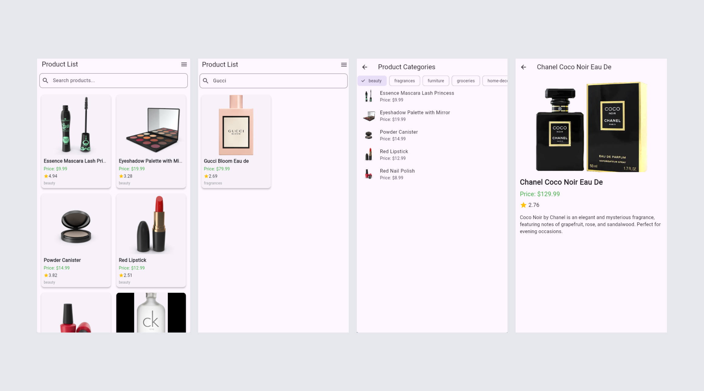

# Shop app with api

A Flutter project showcasing a product listing application with modern UI and essential features.

## Screenshots


https://github.com/user-attachments/assets/51a4e1bb-1a14-4a99-bfc8-f80831bb1315

## Features

- **Product List Screen**: Displays a list of products.
- **Product Details Screen**: Provides detailed information about a selected product.
- **Category Screen**: Allows users to browse products by category.
- **Image Caching**: Uses `cached_network_image` for efficient image loading.
- **Carousel Slider**: Implements a carousel for featured products or promotions.

## Getting Started

### Prerequisites

- [Flutter SDK](https://flutter.dev/docs/get-started/install) (version 3.7.0 or higher)
- A code editor like [Visual Studio Code](https://code.visualstudio.com/) or [Android Studio](https://developer.android.com/studio)

### Installation

1. Clone the repository:
   ```bash
   git clone https://github.com/mahabubulhasibshawon/Shop_App_with_Api.git
   cd flutter_test_remote
   ```

2. Install dependencies:
   ```bash
   flutter pub get
   ```

3. Run the app:
   ```bash
   flutter run
   ```

## Dependencies

The project uses the following dependencies:

- `flutter`: Core Flutter framework
- `cupertino_icons`: iOS-style icons
- `http`: For making HTTP requests
- `carousel_slider`: For creating carousels
- `cached_network_image`: For efficient image caching
- `provider`: For state management

## Project Structure

```
lib/
├── main.dart                # Entry point of the application
├── product_list_screen.dart # Displays the list of products
├── product_details_screen.dart # Shows product details
├── product_category_screen.dart # Displays product categories
```

## Screenshots

_Add screenshots of your app here._

## Contributing

Contributions are welcome! Please fork the repository and submit a pull request.

## License

This project is licensed under the MIT License. See the LICENSE file for details.
